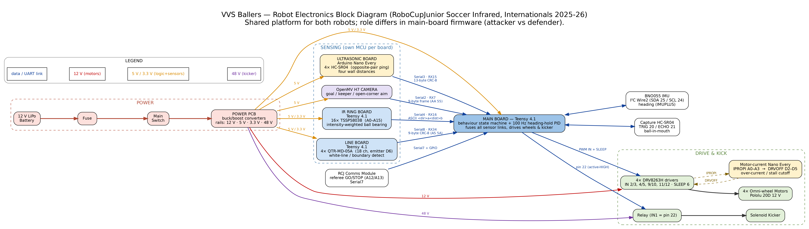

# How the Robot Works

A full technical walkthrough of the VVS Ballers RoboCupJunior Soccer robots — the
electronics, the firmware on each board, how the boards talk to each other, and the
behaviours that let the robot chase, aim, shoot, and stay in bounds. Everything here
is drawn from the firmware in [`Firmware/`](../Firmware) and the wiring in
[`PCB/Wiring/`](../PCB/Wiring).

> The **attacker** and **defender** are the same robot with different main-board
> firmware. Sections below cover the shared hardware first, then the two roles.

---

## 1. System architecture

The robot is a **federation of microcontrollers**, not one big program. Each fast
sensor job runs on its own MCU and streams a compact result to the **main board**,
which fuses everything and drives the wheels and kicker.

```
            IR ring (Teensy 4.1)            OpenMV H7 camera
            16× TSSP58038                   goal / keeper vision
                 │ Serial (ASCII)                │ Serial2 (9-byte)
                 ▼                                ▼
   Line ring ─Serial8(9-byte)►  ┌─────────────────────────┐  ◄Serial3(13-byte)─ Ultrasonic
   4× QTR-MD-05A                 │   MAIN BOARD Teensy 4.1  │                     4× HC-SR04
   (Teensy 4.1)                  │  • BNO055 heading PID    │                     (Nano Every)
                                 │  • behaviour state mach. │
   Comms module ─Serial7/GO-STOP►│  • 4× DRV8263H omni drive│
   (referee start/stop)          │  • capture sensor + kick │
                                 └─────────────────────────┘
                                        │            │
                                  4 omni wheels   48 V solenoid kicker
```

Why split it up: the IR ring, the line ring, and the ultrasonics each need to be
sampled fast and continuously. Giving each its own MCU keeps those tight loops off
the main control CPU, and the **CRC-checked UART links** mean a glitch on any wire
is rejected rather than acted on.

| Board | MCU | Link to main | Source |
|---|---|---|---|
| IR ball ring | Teensy 4.1 | Serial4 (ASCII) | [`Firmware/IR_Ball_Sensor`](../Firmware/IR_Ball_Sensor) |
| Line ring | Teensy 4.1 | Serial8 (binary) | [`Firmware/Line_Sensor`](../Firmware/Line_Sensor) |
| Ultrasonic | Nano Every | Serial3 (binary) | [`Firmware/Ultrasonic`](../Firmware/Ultrasonic) |
| Camera | OpenMV H7 | Serial2 (binary) | [`Firmware/Camera`](../Firmware/Camera) |
| Comms module | (referee) | Serial7 + GO/STOP pins | rules module |
| Motor-current (optional) | Nano Every | — (external DRVOFF) | [`Firmware/Motor_Current`](../Firmware/Motor_Current) |

---

### Block diagram & parts list

A wiring-level block diagram of the whole electronics stack:



The complete bill of materials (every board, sensor, driver, and the kicker) is in
[`VVS_Ballers_BOM.xlsx`](VVS_Ballers_BOM.xlsx).

---

## 2. Power and electrical

From [`PCB/Wiring/Power_PCB.pdf`](../PCB/Wiring/Power_PCB.pdf) and
[`PCB/Wiring/Main_PCB.pdf`](../PCB/Wiring/Main_PCB.pdf):

- **Battery → fuse → main switch → switched 12 V node.** Best-practice single-pole
  switching on the positive lead; ground stays common.
- The switched 12 V feeds four converters and the battery-capacity indicator:
  - **12 V rail** → main board (motor supply); bulk cap 1000–2200 µF for motor noise.
  - **5 V buck** → main, IR, line, ultrasonic boards **and the OpenMV camera**.
  - **3.3 V buck** → main, IR, line boards (sensor logic).
  - **48 V boost** → the solenoid kicker supply (bulk cap ≥ 63 V).

The **48 V** solenoid rail sits exactly at the rules' power ceiling (≤ 48 V DC) — the
hardest legal kick. Logic and motors stay on the lower rails.

On the main board the Teensy 4.1 takes 5 V on VIN; the BNO055, capture HC-SR04 and
sensor logic run at 3.3 V; the four motor drivers take 12 V power and 3.3 V logic.

---

## 3. Drive base — omni wheels, drivers, heading hold

### Motors and pin map

Four omni wheels in a diamond, each on a **DRV8263H** brushed driver in PH/EN mode
(`MODE/SR/DRVOFF → GND`, `SLEEP → pin 6` shared). Motors are Pololu 12 V gearmotors.

| Motor | IN1 / IN2 (Teensy) | In firmware |
|---|---|---|
| M1 | 2 / 3 | `M1_EN=2, M1_DIR=3` |
| M2 | 4 / 5 | `M2_EN=4, M2_DIR=5` |
| M3 | 9 / 10 | `M3_EN=10, M3_DIR=9` |
| M4 | 11 / 12 | `M4_EN=12, M4_DIR=11` |

`setMotor()` drives one pin as direction and PWMs the other (`analogWrite`, speed
clamped to ±255). The optional **IPROPI** current-sense and **FAULT** outputs are
broken out but unused in the default build.

### Translation without rotation

The robot drives in straight "sectors" while a gyro keeps it pointing forward. Two
sign tables do the mixing:

- `moveSign[sector][motor]` — the four wheel signs for FORWARD / RIGHT / LEFT / BACK.
- `turnSign[4] = {-1, +1, -1, +1}` — the spin-in-place mix.

`driveSector(sector, speed, correction)` = `moveSign·speed + turnSign·correction`.
With `speed = 0` only the `turnSign·correction` term survives, which is a **pure spin
in place** — exactly how the attacker rotates to aim. The defender uses a fuller
holonomic mixer, `driveXY(vx, vy, corr)`, that combines a forward and a sideways
velocity and then **normalises** so no wheel command exceeds 255.

### Heading-hold PID (BNO055)

A **BNO055** IMU on `Wire2` (SDA 25, SCL 24, address 0x28) runs in **IMUPLUS** mode
— gyro + accelerometer fusion, magnetometer ignored, so nearby motors and steel
can't pull the heading. At boot the firmware averages 20 yaw samples to define
"forward", then a PID holds it:

```
Kp = 6.0,  Ki = 0.0,  Kd = 0.5,  MAX_CORRECTION = 200,  loop = 100 Hz
correction = K_SIGN · (Kp·err + Ki·∫err + Kd·dErr),  err = wrap180(heading − setpoint)
```

`K_SIGN` flips the correction sense per chassis wiring (−1 on the attacker). Because
IMUPLUS yaw drifts slowly, the defender adds a **heading dead-band** (ignore errors
< 3°) and **relaxes heading when parked**, so it doesn't slowly spin chasing drift.

---

## 4. Sensors

### 4.1 IR ball ring — where is the ball?

**Hardware** ([`PCB/Wiring/IR_PCB.pdf`](../PCB/Wiring/IR_PCB.pdf)): 16× **TSSP58038**
IR receivers in a ring on a dedicated Teensy 4.1, analog channels **A0–A15**, with
**front = channel 15**, 22.5° apart (360/16). Each channel is an RC low-pass —
`IRout → 10 kΩ → pin, pin → 0.22 µF → GND` — whose time constant
(10 k × 0.22 µF = 2.2 ms ≈ 72 Hz) sets the real ceiling on how fast a moving ball can
be tracked.

**Algorithm** ([`Firmware/IR_Ball_Sensor/Code2_Calibrated`](../Firmware/IR_Ball_Sensor)):

1. Read all 16 channels. Convert each to an **intensity = baseline − raw** (the
   sensors pull *down* with IR, so a lower raw means a stronger signal). Anything at
   or below `NOISE_FLOOR = 12` is treated as ambient and zeroed.
2. Damp a **lone hot channel** whose both neighbours are dark (a reflection/noise
   spike) — a real ball always lights ≥ 2 adjacent sensors.
3. Take the **intensity-weighted vector sum** over every lit channel and
   `atan2(Σw·sinθ, Σw·cosθ)` → the ball **bearing**. Summing vectors is smooth across
   the 0°/360° wrap and more robust than "strongest sensor ± 2".
4. **Detection hysteresis:** assert "ball seen" when the peak intensity ≥ 60, release
   below 35 — no chattering at the edge of range.
5. Smooth the bearing with an EWMA (α = 0.45).

**Calibration** (baked into `Code2_Calibrated`, captured 2026-06-27): per-channel
no-ball baselines (≈ 1006–1007, just under the 10-bit rail) and per-channel gains
(all within ±4 % of 1.0 — the ring is well matched, so gain is not the limiting
factor). `Code2_Refined` is the same code with default (uncalibrated) values for
reference, and `Calibration.ino` is the bench tool that captures baselines and
streams all 16 channels to the Serial Plotter.

**Output to main** (IR board Serial2 → main Serial4): legacy ASCII frame
`"<dir>a\t\r\n<dist>b\t\r\n"`, with `500` as the no-ball sentinel. The main board
parses `a` as end-of-direction and `b` as end-of-frame, and treats the bearing in a
**reversed** convention (a ball *ahead* reads near ±180°) — see §6.

### 4.2 Ultrasonic ring — where are the walls?

**Hardware** ([`PCB/Wiring/`](../PCB/Wiring) + [`Firmware/Ultrasonic`](../Firmware/Ultrasonic)):
an **Arduino Nano Every** with **4× HC-SR04**, one per side:

| Side | Sensor | TRIG / ECHO |
|---|---|---|
| FRONT | U4 | D8 / D9 |
| RIGHT | U3 | D4 / D5 |
| BACK | U2 | D6 / D7 |
| LEFT | U1 | D2 / D3 |

**Opposite-pair pinging** is the key trick: firing all four at once lets an adjacent
sensor hear another's burst (false short reading); firing one at a time is safe but
slow. So the board fires **FRONT + BACK together, then RIGHT + LEFT together** — two
adjacent sensors never sound at the same instant, and the cycle is halved. Distance
uses a **temperature-compensated speed of sound** (`c = 331.4 + 0.6·T`), a per-sensor
**median-of-3** kills single fliers, and on a missed echo the sensor **coasts** on
its last value for 2 cycles before reporting out-of-range. Full set runs at ~50 Hz;
range clamps to 20–2600 mm (the field's long axis is 243 cm). A ~1 s watchdog resets
the board if `loop()` ever stalls.

`Ultrasonic_Receiver_MainBoard.ino` is the drop-in parser the main firmware reuses.

> **Orientation note:** the board's natural index order is clockwise F, R, B, L, but
> on this robot it's mounted rotated 180°, so the main firmware remaps the enum to
> `{US_BACK=0, US_LEFT=1, US_FRONT=2, US_RIGHT=3}`. If the board is ever re-seated,
> that enum is the one place to fix. Because the ultrasonic board is **5 V** and the
> Teensy RX is **3.3 V-only**, its TX must be level-shifted into the main board.

### 4.3 Line ring — where is the boundary?

**Hardware** ([`PCB/Wiring/Line_PCB.pdf`](../PCB/Wiring/Line_PCB.pdf)): a Teensy 4.1
with **4× QTR-MD-05A** reflectance arrays = **18 channels** (QTR1–3 give 5 each,
QTR4 gives 3). All emitters share **CTRL_ODD → D6**. The four boards face the four
directions in a "plus":

| Board | Direction | Channels |
|---|---|---|
| QTR1 | RIGHT | A0–A4 |
| QTR2 | FRONT | A5–A9 |
| QTR3 | LEFT | A10–A14 |
| QTR4 | BACK | A15–A17 |

On the field surface, the **white line reads *lower*** than the green field (raw
< ~180). A board "sees the line" when **≥ 2** of its channels are white. Three
sketches share the exact pin map:

- **`Line_PCB_Raw_Reader`** — streams raw ADC for every channel; the calibration tool.
- **`Line_PCB_Detect`** — per-channel fixed thresholds (~200) with hysteresis, 500 Hz.
- **`Line_PCB_Baseline`** — learns each channel's green level for 1 s at boot, then
  flags white on a drop of ≥ 5 below that baseline, 1 kHz. No per-sensor tuning; this
  is the easiest to deploy on a new field.

Both detectors emit the **identical 9-byte packet** (§5.3), so the main board decodes
either with no change.

### 4.4 Camera — where is the goal?

**Hardware/firmware** ([`Firmware/Camera/Goal_Cam.py`](../Firmware/Camera/Goal_Cam.py)):
an **OpenMV H7**, forward-facing, no mirror. It does the one job no other sensor can:
**find the goal and the keeper.** Settings are locked (RGB565 QVGA, fixed
exposure/gain/white-balance) so colour thresholds stay stable across a match.

Each frame it finds the largest **yellow** or **blue** goal blob (LAB thresholds) and
the largest **dark** blob overlapping it (the keeper), then computes:

- `attackBearing` — `(cx − centre) · HFOV/width`, + = goal to the robot's right.
- `openCornerBear` — **the aim angle.** If a keeper is present, it splits the goal at
  the keeper and aims the centre of the **larger open slice**; with no keeper it aims
  the **far corner**, inset slightly so the ball still goes in.
- `attackDist` (coarse, focal-length method), `keeperBearing`, `ownGoalBearing`.

**Camera + IR ball fusion.** Both `Goal_Cam.py` and `Goal_Cam_Ball.py` also detect the
orange ball and put its bearing + coarse distance in the frame (flags bit3 +
`ballBearing` + `ballDist`, §5.2). The **IR ring stays the primary ball sensor**; the
main board treats the camera ball as a **short-range cross-check and fallback** — if
the IR ring loses the ball the attacker chases the camera ball, and within
`CAM_BALL_NEAR_CM` (~25 cm) a large camera-vs-IR disagreement makes it trust the camera
bearing (`USE_CAM_BALL_FUSION`; attacker `camPoll` + fusion block). `Goal_Cam_Ball.py`
adds a richer ball overlay for tuning. Save the chosen script to the H7 as `main.py`.

> **Wiring note:** the IR PCB exposes a camera header on pins 34/35 from an earlier
> plan, but the **current firmware reads the camera on the main board's Serial2**
> (RX2 = pin 7), which is what the attacker sketch decodes.

### 4.5 Capture sensor — is the ball in the mouth?

A fifth **HC-SR04** on the main board looks into the dribbler/capture mouth
(TRIG = 20, ECHO = 21). When the ball sits in the mouth it reads `< 45 mm`; after 2
consecutive in-range pings the ball is "captured" and the kicker can arm (§6, §7).

---

## 5. Inter-board communication

Three of the four links are short **binary frames** that share one design: a 2-byte
sync header, a little-endian payload, and an integrity byte, with the sync bytes
differing between links so a mis-wire can't false-lock one stream onto another. The
**ultrasonic and line** links use an identical **CRC-8 (polynomial 0x07, init 0x00)**;
the lighter **camera** link uses a **modular sum-check** (it carries no
safety-critical distances). A per-link **stale timeout (~200 ms)** means frozen or
dead data is never acted on, and the **IR** link (§5.4) is plain ASCII.

### 5.1 Ultrasonic → Main (Serial3, 13 bytes)

```
[0]=0xAA [1]=0x55 | F.lo F.hi R.lo R.hi B.lo B.hi L.lo L.hi | status | seq | crc8
  distances: uint16 mm, little-endian
  status:    2 bits/sensor (0=OK, 1=out-of-range, 2=held/coasting)
  crc8:      over payload bytes [2..11]
```

### 5.2 Camera → Main (Serial2, 11 bytes)

```
[0]=0xAA [1]=0x55 [2]=flags [3]=attackBearing(i8) [4]=attackDist(u8)
[5]=openCornerBear(i8) [6]=keeperBearing(i8) [7]=ownGoalBearing(i8)
[8]=ballBearing(i8) [9]=ballDist(u8) [10]=checksum
  flags: bit0 attackGoalSeen, bit1 ownGoalSeen, bit2 keeperSeen, bit3 ballSeen
  checksum: (sum of bytes 2..9) & 0xFF
```

### 5.3 Line → Main (Serial8, 9 bytes)

```
[0]=0xA5 [1]=0x5A [2]=mask [3..6]=count[0..3] [7]=seq [8]=crc8(over [2..7])
  mask bits: bit0 RIGHT, bit1 FRONT, bit2 LEFT, bit3 BACK
  count[i]: number of white channels on that board (diagnostics)
```

The `0xA5/0x5A` sync is deliberately different from the ultrasonic link's
`0xAA/0x55`.

### 5.4 IR → Main (Serial4, ASCII)

`"<dir>a\t\r\n<dist>b\t\r\n"`; `a` ends the direction field, `b` ends the frame, and
`500` means "no ball". The distance field is parsed for sync but ignored.

> **Both robots now decode the same line frame.** `Defender_Full` was previously
> written against a *planned* 8-byte depth/side frame the line boards never emitted; it
> now decodes the **same 9-byte mask/counts frame** above. The keeper uses the FRONT
> flag as the up-field box-edge limit and the RIGHT/LEFT flags as corner limits, with
> the **back ultrasonic** providing the continuous standoff (a reflectance ring has no
> continuous distance). The attacker's fused boundary escape uses the same frame.

---

## 6. Attacker behaviour

`Firmware/Attacker/Attacker_Chase_Aim_Kick_Line` runs a 100 Hz loop with a strict
priority each pass:

```
1. HAVE BALL  → AIM the open corner → KICK     (overrides everything)
2. BOUNDARY ESCAPE (line + ultrasonic agree, debounced)
3. CHASE the ball
4. IDLE
```

**Chase.** The ball bearing from the IR ring is classified into a drive sector —
forward when `|dir| ≥ 150` (the ball reads near ±180 when ahead, by this robot's
reversed convention), right/left in the side wedges, back around 0 — and the robot
translates that way at speed 250 while the heading PID keeps it square.

**Boundary escape (the out-of-bounds defence).** A side counts as the **field
boundary only when both sensors agree**: that side's ultrasonic reads `< 300 mm`
**and** that direction's QTR board sees the white line. The robot then flees the
**closest** confirmed boundary (front→back, right→left, etc.). If *either* the line
or ultrasonic link is stale, no escape fires — the robot never acts on data it can't
trust. A side must also persist for **3 consecutive passes** (`AVOID_CONFIRM`) before
the robot flees, so a single spurious frame can't make it dart out of bounds. This
two-of-two design is deliberate: an out-of-bounds penalty removes the robot for a
full minute and voids any goal scored meanwhile, so a **false** boundary trigger
(needlessly fleeing) and a **missed** one (crossing the line) are both expensive, and
requiring agreement guards against both.

**Aim — "the turn thing".** The moment the ball is captured the robot freezes its
heading, then when the camera reports the goal it sets
`aimHeading = heading + AIM_TURN_SIGN · openCornerBear` and **spins in place** (drive
speed 0, only the heading PID turning the chassis) until the open corner is within
**5°** dead ahead. Only then does it kick. If the goal leaves frame, `aimHeading` is
left untouched, so the robot holds its last good aim on the gyro.

**Kick.** Once captured *and* aimed, a non-blocking state machine fires the solenoid:
`K_IDLE → K_KICKING (500 ms) → K_COOLDOWN (1500 ms)`. Several safety layers wrap it
(see §7).

`REQUIRE_GOAL_TO_KICK` can be set to 0 for bench testing (kick on capture alone, no
camera); the default match build requires the goal to be seen and aligned.

---

## 7. Defender (goalkeeper) behaviour

`Firmware/Defender/Defender_Full` is a five-state machine:
`GUARD → TRACK → CLEAR → RECOVER` (plus `STOPPED` for the referee).

- **GUARD** — centre in the mouth (ultrasonic left/right difference) and hold the
  standoff. When the ball is seen → **TRACK**.
- **TRACK** — a lateral PID (Kp = 3.0) slides the keeper along the goal to stay in
  front of the ball, with an **intercept boost** when the ball's bearing is changing
  fast. Hold depth meanwhile. On ball contact → **CLEAR**; if the ball is lost →
  GUARD.
- **CLEAR** — push forward (`CLEAR_PUSH_VY = 200`) for 450 ms to knock the ball away,
  steering toward the open corner if the camera is fitted → **RECOVER**.
- **RECOVER** — re-home depth and re-centre, then → GUARD (or on timeout).

**Staying on "the D".** No robot may be *fully* inside the penalty area, so the keeper
rides the **edge** of the goal area rather than sitting in it. The **back ultrasonic**
gives the continuous standoff (the depth-PID datum), while the **line ring** marks the
box edges: the FRONT board flags the up-field box line so the keeper does not drift
up-field past it, and the RIGHT/LEFT boards flag the side lines as corner limits. A
reflectance ring has no continuous distance, which is exactly why depth comes from the
ultrasonic and the line only hard-stops at the edges. A **back-wall safety cross-check**
never reverses into the own goal when the back wall is < 90 mm, a holonomic mixer with
output normalisation keeps motion smooth, and the keeper relaxes its heading when
stationary so it doesn't creep on gyro drift.

The clearing kicker is a four-phase machine tuned shorter than the attacker's:
`K_READY → K_ARMING (250 ms) → K_FIRING (100 ms) → K_COOLDOWN (2000 ms)`.

> `Defender_Full` shares the attacker's proven 9-byte line decoder, so the keeper's line
> edge limits use the same board→direction mapping as the attacker's fused escape.

---

## 8. Kicking — capture, solenoid, and safety

The kicker is a relay-switched solenoid on the **48 V** rail (relay IN1 = pin 22,
**active-HIGH** on this board, VCC 5 V). Capture is the main-board HC-SR04 in the
mouth. The firmware is deliberately conservative about energising a coil:

- **Capture debounce:** the ball must read `< 45 mm` for 2 consecutive pings before
  it counts as captured.
- **Pulse + cooldown:** the coil is on for a fixed `KICK_MS`, then forced to rest for
  `KICK_COOLDOWN_MS` before it can fire again.
- **Hard max-on cutoff:** a guard *above* the state machine force-releases the coil if
  it is ever energised longer than `KICK_MAX_ON_MS` (600 ms on the attacker), no
  matter what — a solenoid must never be left latched on.
- **Boot-safe:** the relay is driven to its release level **before** its pin becomes
  an output, so a mis-set polarity can't hold the coil on at power-up.

The kicker passes the rules' on-field power test (kick from inside one goal; the ball
must not rebound off the far goal back into your own).

---

## 9. Mechanical design

The chassis is a 4-omni-wheel diamond designed in **Fusion 360**
([`CAD/Fusion`](../CAD/Fusion)), with printable parts grouped by subsystem
([`CAD/Printable`](../CAD/Printable)). Printed parts include the side walls, omni wheels and
rollers, the base and top base, the **capture area** (the dribbler mouth that holds
the ball within the rules' ≤ 1.5 cm capture-zone limit), the IR cover, camera
holders, couplings, ultrasonic holders, and a **handle** (the rules require a stable
handle with 5 cm of clearance for lifting).

A notable sub-assembly is the **support-beam structure** (documented in
[`Legacy/CAD/Unused`](../Legacy/CAD/Unused)) that rigidly ties the **Main PCB → IR
cover → ultrasonic plate** together and clamps the previously-floating Power PCB at
all four corners, with screw pilots verified concentric to the boards' mounting
holes. Older motor/bracket and chassis studies are kept in
[`Legacy/CAD`](../Legacy/CAD).

---

## 10. Tuning reference

The constants most worth knowing, by file:

| Constant | Value | Where / why |
|---|---|---|
| Heading PID | Kp 6.0 / Ki 0 / Kd 0.5 | all main-board sketches |
| Control loop | 100 Hz | all main-board sketches |
| `BOUNDARY_MM` | 300 mm | attacker — line+US must agree under this to flee |
| `AVOID_CONFIRM` | 3 passes | attacker — boundary debounce |
| `KICK_AIM_TOL_DEG` | 5° | attacker — kick only when open corner is this aligned |
| `CAPTURE_BALL_MM` | 45 mm | capture mouth "ball present" |
| `KICK_MS` / cooldown / max-on | 500 / 1500 / 600 ms | attacker kicker |
| `BACK_STANDOFF_MM` | 220 mm | defender — back-ultrasonic standoff (depth datum) |
| `KP_LAT` / `KP_DEPTH` | 3.0 / 1.2 | defender lateral / depth PIDs |
| IR detect on/off | 60 / 35 | IR hysteresis |
| IR `NOISE_FLOOR` | 12 | IR ambient rejection |
| Line "sees line" | ≥ 2 white ch. | line boards |
| US range / rate | 20–2600 mm / ~50 Hz | ultrasonic board |

---

## 11. Known caveats (kept honest)

1. **Defender line frame** — `Defender_Full` decodes the same 9-byte mask frame the line
   boards emit (the old 8-byte depth contract is gone). Depth/standoff is the back
   ultrasonic; the line marks the box edges (§5.4, §7).
2. **Camera is read on the main board's Serial2**, not the IR-board header on pins
   34/35 (§4.4).
3. **Motor-current watchdog needs a board mod** — it only works if each DRV8263H's
   `DRVOFF` is lifted off GND and wired to the Nano (`Firmware/Motor_Current`).
4. **Level-shift the ultrasonic TX** into the 3.3 V Teensy RX (§4.2).
5. **The ultrasonic side enum is robot-specific** (board mounted 180°); fix it in one
   place if the board is re-seated.
6. **Roles: flash-time by default, with optional radio switching** — the attacker and
   defender are the same robot with different main-board firmware. An optional
   nRF24L01+ link (`Firmware/Comms/RobotLink`) adds partner-aware role-switching: a
   robot that loses its partner's heartbeat covers the goal as keeper and resumes its
   base role at the next referee GO. Without the radio fitted, each robot plays its
   static flash-time role.

---

## 12. Pin map (main board, quick reference)

| Function | Teensy 4.1 pin(s) |
|---|---|
| Motor SLEEP (shared) | 6 |
| M1 / M2 / M3 / M4 IN1,IN2 | 2,3 / 4,5 / 9,10 / 11,12 |
| BNO055 IMU (Wire2) | SDA 25, SCL 24 |
| Capture HC-SR04 | TRIG 20, ECHO 21 |
| Kicker relay IN1 | 22 |
| IR link (Serial4 RX) | 16 |
| Ultrasonic link (Serial3 RX/TX) | 15 / 14 |
| Line link (Serial8 RX) | 34 |
| Camera link (Serial2 RX) | 7 |
| Comms module (Serial7 + GO/STOP) | RX7/TX7 + A12/A13 |
| OLED (optional) | 18 / 19 |

*All claims above trace to the firmware in [`Firmware/`](../Firmware) and the wiring
PDFs in [`PCB/Wiring/`](../PCB/Wiring). When in doubt, the code and the wiring are the
source of truth.*
